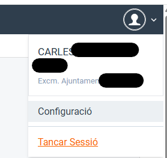
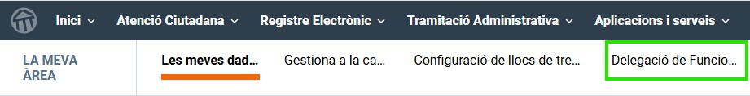
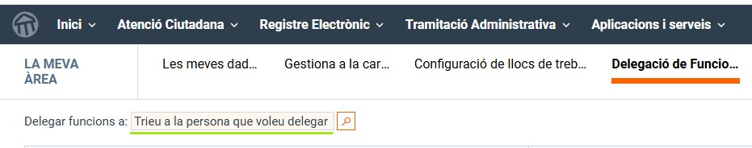
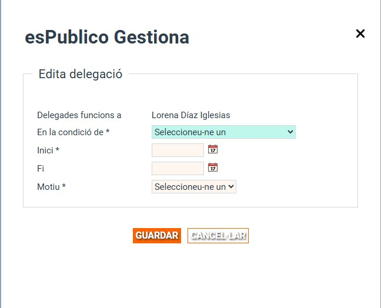

# 🔁 Guia de delegació de funcions

Aquesta guia t’explica, pas a pas, com **delegar les teves funcions a un altre usuari** quan no puguis exercir-les temporalment (vacances, baixa, permís, etc.) mitjançant l’aplicació **Gestiona**.

---

## ⚙️ Pas 1 · Accedir a la configuració de l’usuari

1. Dins el Gestor d'expendients a dalt a la dreta.
2. Accedeix al menú de l’usuari.
3. Fes clic a **Configuració**.

📸 *Captura de pantalla:*

---

## 🗂️ Pas 2 · Obrir la delegació de funcions

Dins la configuració de l’usuari:

1. Localitza l’opció **Delegació de funcions**.
2. Accedeix-hi per començar la configuració.

📸 *Captura de pantalla:*

---

## 👤 Pas 3 · Seleccionar la persona delegada

A l’apartat **Delegar funcions a**:

1. Escriu el **nom de l’usuari** a qui vols delegar les teves funcions.
2. Prem la **lupa 🔍** per fer la cerca.
3. Selecciona l’usuari correcte del llistat.

📸 *Captura de pantalla:*

---

## 🗓️ Pas 4 · Definir les condicions de la delegació

Completa la informació necessària perquè la delegació sigui efectiva:

### 🔖 En condició de
Escull el **càrrec o rol** amb què actuarà la persona delegada (si en té més d’un).

### ▶️ Data d’inici
Indica a partir de quin dia s’activarà la delegació.

### ⏹️ Data de finalització
Indica fins a quin dia serà vigent.

### 📝 Motiu
Especifica el motiu de la delegació. Per exemple:
- Vacances
- Baixa
- Permís
- Altres motius

Finalment, **desa els canvis** per activar la delegació.

📸 *Captura de pantalla:*

---

## ✅ Bones pràctiques

💡 Revisa sempre les dates abans de desar  
💡 Selecciona correctament el càrrec de la persona delegada  
💡 Modifica o cancel·la la delegació si la situació canvia  

---

## ℹ️ Informació important

- La delegació només és vàlida dins del període indicat.
- Pots gestionar la delegació en qualsevol moment des de la configuració de l’usuari.
- Una delegació ben configurada garanteix la continuïtat del servei.

---

**Ajuntament de Cabrils · Píndoles formatives 💡**
